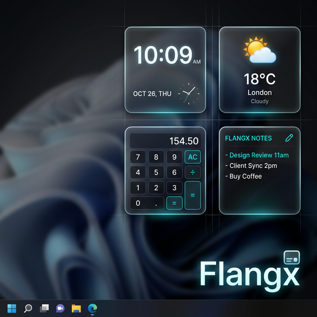

# 🏢 Flangx: Desktop Widgets

A lightweight, grid-snapping widget system for Windows that lives directly on your desktop. No installers, no heavy frameworks—just pure performance and structural utility.

## ⚡ Quick Start (PowerShell)
You can compile and launch the application directly from your terminal:

```powershell
# 1. Download the repository (axsnlg-f-release branch)
git clone -b axsnlg-f-release https://github.com/Santaslileper/Flangx.git

# 2. Compile and Launch
cd Flangx
& "C:\Windows\Microsoft.NET\Framework64\v4.0.30319\csc.exe" /nologo /target:winexe /out:Flangx.exe core/*.cs /reference:System.Windows.Forms.dll,System.Drawing.dll,System.Core.dll,System.Data.dll,System.Xml.dll /win32icon:assets/app.ico /platform:x64; Start-Process .\Flangx.exe
```

## ✨ Key Features
- **Grid Snapping**: Widgets automatically align to your desktop icons for a pixel-perfect layout.
- **Item Bumping**: Dragging a widget into a occupied space "bumps" existing widgets or icons out of the way, similar to iOS.
- **Specialized Types**:
  - 📝 **Notes**: Quick text containers that save instantly.
  - 🕒 **Clock**: High-contrast digital time.
  - ⏲️ **Timer**: Productive countdown with input.
  - 🧮 **Calculator**: Simple math directly on your desktop.
  - 🌐 **Mini Browser**: Keep a reference page or search bar open.
  - 🔋 **Battery**: Real-time monitoring of your system percentage.
  - 🌦️ **Weather**: A minimalist, text-based dashboard.
- **Searchable Selector**: Click [+] to search all available types, including native and mods.
- **Drag-to-Spawn**: Drag widget names directly from the selector onto your desktop.
- **Modding System**: Drop C# scripts (`.cs`) into the `mods/` directory. They compile and load at runtime automatically.
- **Recently Closed**: Re-open previous widgets from the selector's "Recently Closed" tab.
- **Persistence**: Remembers position, size, and custom opacity (use mouse wheel on header) automatically.
- **Always on Top**: Toggle widgets to float above other windows or stick them to the desktop.

## ⚙️ How It Works
The engine uses a split architecture for maximum efficiency:
1. **Rust Core (`interaction.dll`)**: Handles high-performance desktop icon detection and grid math.
2. **C# UI (`Flangx.exe`)**: Manages the windowing system, specialized widget logic, and GDI+ rendering.

## 🛠 Compilation & Development
The project is designed to be built using the C# compiler already included in every Windows installation.

```powershell
# Compile the entire project
& "C:\Windows\Microsoft.NET\Framework64\v4.0.30319\csc.exe" /target:winexe /out:Flangx.exe core/*.cs /reference:System.Windows.Forms.dll,System.Drawing.dll,System.Core.dll,System.Data.dll,System.Xml.dll /win32icon:assets/app.ico /platform:x64
```

## ⚖️ License & Privacy
- **Privacy**: 100% Offline. Your notes and settings never leave your machine.
- **License**: **Proprietary (Structured Freedom)**. All rights reserved. See [LICENSE.md](LICENSE.md) for full details on study usage and bug reporting permissions.

## 🏷️ Why Flangx?

### 🛠️ The Technical "Flange"
In engineering, a flange is a projecting rim used for strengthening or attachment. **Flangx** applies this concept to your desktop: every widget is built with an invisible structural "rim" that couples it to the underlying Windows icon grid. This ensures that your layout isn't just a collection of floating boxes, but a rigid, synchronized system with mechanical-grade alignment.

### ⚖️ The Philosophy: "Structured Freedom"
*Order is the foundation of flow.* We believe that a chaotic desktop is a chaotic mind. By accepting the structure of the grid, you are freed from the friction of window management. When every tool has a "flanged" home, you stop managing your workspace and start inhabiting your work.


